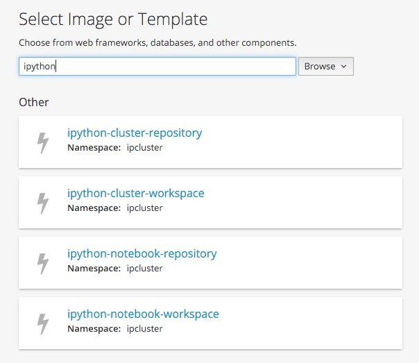
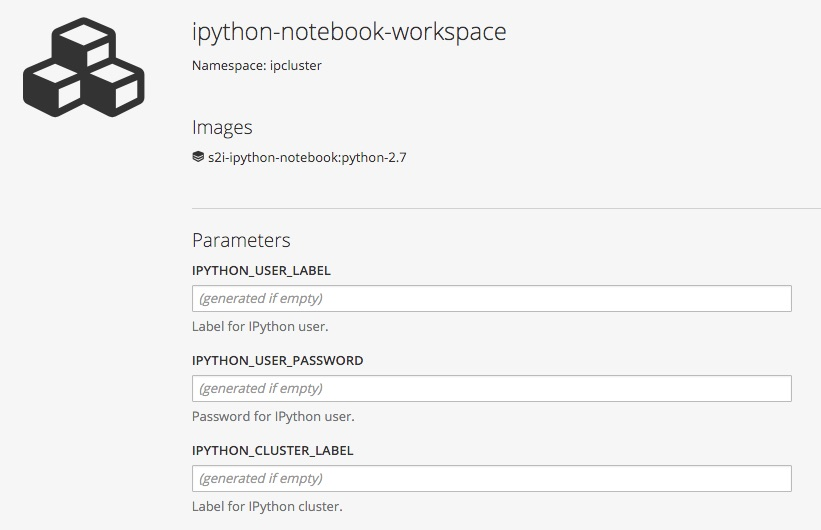
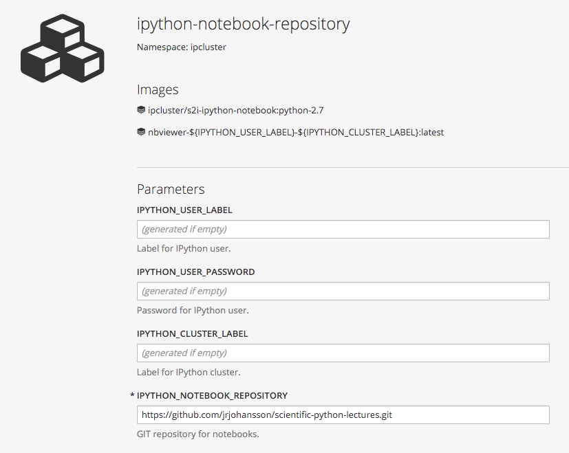
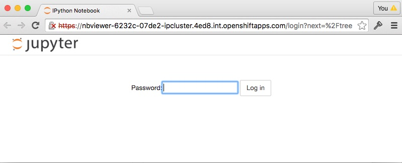
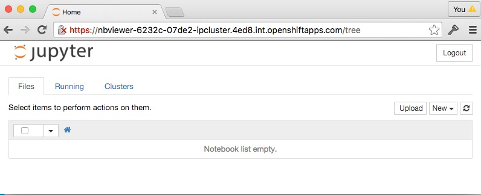
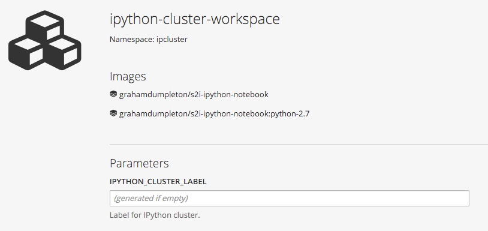
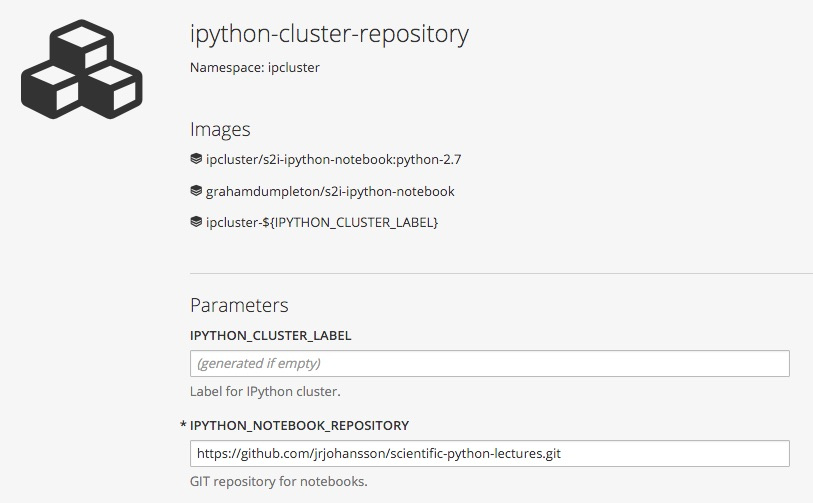
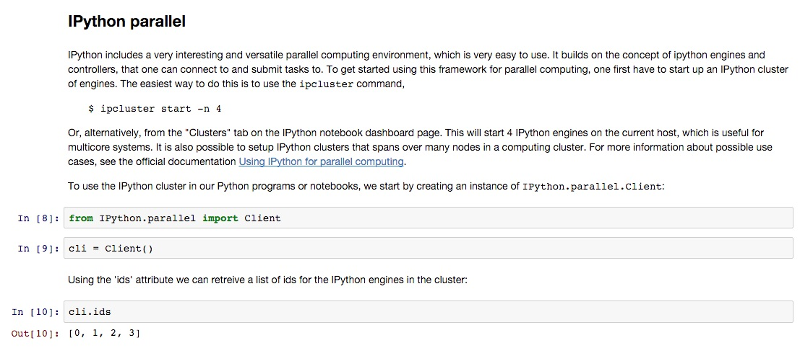

# IPython Docker Images

This repository contains the source code for a proof of concept IPython Docker image. It is being provided to stimulate discussion on creating better ways of hosting IPython notebooks using cloud hosting services.

Only Python 2.7 is supported at this point in time. The resulting Docker image can be found on the Docker Hub registry as [grahamdumpleton/s2i-ipython-notebook](https://hub.docker.com/r/grahamdumpleton/s2i-ipython-notebook/).

The Docker image actually provides a number of capabilities. These are:

* Ability to be run directly to provide an online IPython notebook viewer.
* Ability to be run to create a controller instance for an IPython engine cluster.
* Ability to be run to create an instance of an IPython engine participating in a cluster.

The Docker image can be used as a base image to create a custom derived image which installs additional required system packages, Python packages, or which incorporates IPython notebooks to be used via the IPython notebook browser.

The Docker image also embeds support for the [Source to Image](https://github.com/openshift/source-to-image) (S2I) tool for incorporating from a GIT repository IPython notebooks, Python package requirements and other files such as data set files, into a new Docker image, without you needing to know how to create a Docker image yourself.

The S2I tool can be used directly in a local environment, or indirectly through being triggered from an [OpenShift 3](http://www.openshift.org) environment.

To simplify hosting of IPython using OpenShift, template definitions for OpenShift are provided which can be loaded to streamline creation of IPython notebook viewer instances and IPython engine clusters under OpenShift.

## Future directions and known issues

The Docker image created from this repository is a proof of concept only. The author is not a regular user of IPython and thus is not qualified to dictate what may be the best way of setting up an IPython environment using cloud technologies which may improve the productivity of more serious IPython users.

The work done so far will only therefore progress further with sufficient feedback, or better still, direct involvement of people who are users of IPython who see some benefit from developing it further and who may be willing to take over the project.

Areas which still need to be developed are:

* List of pre installed Python packages necessary to provide a good base environment.
* Support for persistent volumes under OpenShift to allow retention of in progress work.
* Better ways of uploading/downloading in progress work from a transient workspace.

At this point in time the following known issues also exist:

* When building a workspace from a GIT repository, although the image build is adequately quick, it is taking a lot longer than expected for that image to be pushed out to nodes in an OpenShift environment. It is not known yet what limitation is being encountered or whether it is a setup issue with the specific OpenShift environment used for testing.

Finally be aware that since this is a proof of concept, don't expect that it will continue to work in the same way over time or even that the names of images will stay the same. It is likely inevitable that there will be changes as the concept is developed.

If you do try out the Docker images and use it with OpenShift, please register your interest in the repository and what it provides so that it is known that people are using it.

## Loading the OpenShift templates

The OpenShift templates can be found at:

* https://raw.githubusercontent.com/GrahamDumpleton/s2i-ipython-notebook/master/ipython-template.json

To load the templates into an OpenShift environment you can use the command:

    oc create -f https://raw.githubusercontent.com/GrahamDumpleton/s2i-ipython-notebook/master/ipython-template.json

The templates can be loaded into just the project it is required for, or if you have administration access it can be loaded into the ``openshift`` namespace if it should be available across all projects within the OpenShift environment.

To load the templates into the ``openshift`` namespace use the command:

    oc create -f https://raw.githubusercontent.com/GrahamDumpleton/s2i-ipython-notebook/master/ipython-template.json -n openshift

## Available application templates

Two different application templates for IPython notebook viewers are provided for OpenShift. These are:

* **ipython-notebook-workspace** - Creates an empty IPython notebook viewer application. Notebooks can be uploaded via the IPython notebook viewer interface.
* **ipython-notebook-repository** - Creates a populated IPython notebook viewer application where the IPython notebooks and any other required files are pulled from a nominated GIT repository. Additional Python packages can be installed by listing them in a ``requirements.txt`` file located in the root directory of the GIT repository.

Both types of IPython notebook viewers will be automatically made available on a public URL using a secure connection (HTTPS). A specific password for the IPython notebook viewer can be nominated or a random one created for you.

Two different application templates for an IPython cluster are also provided. These are:

* **ipython-cluster-workspace** - Creates an IPython cluster controller as well as a single IPython engine instance. The IPython engine workspace will be empty and only pre defined Python packages installed by the image will be available.
* **ipython-cluster-repository** - Creates an IPython cluster controller as well as a single IPython engine instance. The IPython engine workspace will be populated from a nominated GIT repository. Additional Python packages can be installed by listing them in a ``requirements.txt`` file located in the root directory of the GIT repository.

When creating an IPython engine cluster it can be linked by name to specific IPython notebook viewer instances to allow allocation of the resources to a specific user.

Although only a single instance of an IPython engine will be created initially, additional instances can be created by scaling up the ``ipengine`` pod.

The application templates can be found when adding to a project using the UI by filtering on ``ipython``.

## Creating the IPython notebook viewer

To create an empty workspace with no exiting notebooks, select the ``ipython-notebook-workspace`` template from the UI when adding to an existing project. You will be presented with the following template parameters. 

These parameters are all optional. If not supplied they will be filled out with random values.

The purpose of the parameters are as follows:

* **IPYTHON_USER_LABEL** - Label for identifying a specific user that the IPython notebook viewer is being created for. This will be used as part of the automatically generated host name for the instance.
* **IPYTHON_USER_PASSWORD** - A known password for accessing the IPython notebook viewer instance. If not supplied and a random value used, that value can be determined by interrogating the environment of the deployment configuration for the application created.
* **IPYTHON_CLUSTER_LABEL** - Label for identifying an IPython cluster being created as backend to this IPython notebook viewer instance.

To create a workspace which is populated with the contents of a GIT repository, for example, notebooks, data set file etc, select the ``python-notebook-repository`` template from the UI when adding to an existing project. You will be presented with the following template parameters.

The additional parameter in this case is:

* **IPYTHON_NOTEBOOK_REPOSITORY** - The URL for the GIT repository to be used to populate the IPython notebook viewer instance. If the GIT repository contains a ``requirements.txt`` file in the root directory of the repository, those additional Python packages will also be installed.

In both cases, the final application name in OpenShift will be the expansion of:

    nbviewer-${IPYTHON_USER_LABEL}-${IPYTHON_CLUSTER_LABEL}

When the user label or cluster label are not supplied the random value used will consist of 5 lower case characters.

## Determining the randomly assigned password

If you did not supply a password when creating the IPython notebook viewer a random 8 character password will be provided for you. You can access this password by interrogating the set of environment variables recorded against the deployment configuration for the application. You will need to use the ``oc`` program on the command line for this.

For example, if the final application name were ``nbviewer-6232c-07de2`` you would use the ``oc env`` command:

    $ oc env dc/nbviewer-6232c-07de2 --list
    # deploymentconfigs nbviewer-6232c-07de2, container nbviewer-6232c-07de2
    IPYTHON_CONTAINER_TYPE=viewer
    IPYTHON_CLUSTER_LABEL=07de2
    IPYTHON_USER_PASSWORD=a7cabcc3

The password is that listed against the ``IPYTHON_USER_PASSWORD`` environment variable. This can then be supplied in the password field when visiting the IPython notebook viewer.

Once signed in you will then be presented with the IPython notebook viewer workspace.

## Parallel and distributed computing with IPython

When using IPython notebook viewer, when you open each notebook a local IPython process will be created for running that notebook. Everything that now runs within that notebook will run within that single process.

If you want to run any algorithms that could benefit from parallelism you have a few options.

The first is to make use of multithreading within the local process. For CPU intensive operations this will though not provide any benefit due to the limitations of the Python global interpreter lock. Use of multi threading within IPython would also get complicated due to the way that code blocks can be re executed at will. Use of multi threading is therefore not recommended.

The second alternative to achieving parallelism is to make use of the Python multiprocessing module. This allows work to be farmed out to separate processes within the same host or container.

A third option is to use IPython's own support for parallel computing.

With this third option a seperate cluster of processes is set up which code executing within the IPython notebook viewer would communicate with to distribute tasks. This cluster can consist of processes on the same host, or could be distributed across others hosts or containers as well, with the later having the potential for providing access to a much greater amount of resources.

It is this final option which this Docker image targets and which when combined with OpenShift, provides a simple way of backing an IPython notebook viewer with a IPython parallel computing cluster distributed across one or more hosts.

## Creating an IPython engine cluster

To create an empty IPython engine cluster, select the ``ipython-cluster-workspace`` template from the UI when adding to an existing project. You will be presented with the following template parameters.

The purpose of the parameters are as follows:

* **IPYTHON_CLUSTER_LABEL** - Label for identifying an IPython cluster being created as backend to this IPython notebook viewer instance.

In order to associate this IPython cluster with a specific users IPython notebook viewer instance, it should be provided the same value as that which was used for the similar field when creating the IPython notebook viewer application.

As no user name need be supplied, you technically could link up the IPython cluster with multiple IPython notebook viewer application instances for different users if that made sense for the use case.

To create an IPython engine cluster which is populated with the contents of a GIT repository, for example, data set files etc, select the ``python-cluster-repository`` template from the UI when adding to an existing project. You will be presented with the following template parameters.

The additional parameter in this case is:

* **IPYTHON_NOTEBOOK_REPOSITORY** - The URL for the GIT repository to be used to populate the IPython engine cluster instance. If the GIT repository contains a ``requirements.txt`` file in the root directory of the repository, those additional Python packages will also be installed.

At present this is notionally seen as most likely being the same GIT repository as is used to populate the IPython notebook viewer application instance, however, this need not be the case.

In both cases, the final application name in OpenShift will be the expansion of:

    ipcluster-${IPYTHON_CLUSTER_LABEL}

When the cluster label is not supplied the random value used will consist of 5 lower case characters.

## Using the IPython engine cluster

So long as the same cluster label is used in the IPython notebook viewer application instance and the IPython engine cluster they will be automatically linked together.

To make use of the cluster from the notebook viewer, you would then start out with the Python code:

    from IPython.parallel import Client
    cli = Client()
    cli.ids

For an example of using ``IPython.parallel``, see the the **Lecture-6B-HPC** notebook provided by the default GIT repository sourced from:

* https://github.com/jrjohansson/scientific-python-lectures.git

when using the ``ipython-notebook-repository`` template.

## Using the OpenShift command line

Although the examples shown here use the OpenShift UI to create instances of the IPython notebook viewer and IPython engine cluster, the OpenShift ``oc new-app`` command could just as readily be used. The ``--param`` or ``-p`` option should be used with ``oc new-app`` to fill in any template parameters.

## Using the images with Docker directly

OpenShift definitely makes using these Docker images much easier but there is nothing special about the images that would preclude using them with Docker directly separate to any OpenShift installation. When using the Docker images directly you will need to do a lot more work in respect of exposing ports and linking the containers together. For now, how to use the Docker images directly with ``docker`` will not be described, but it definitely is possible.